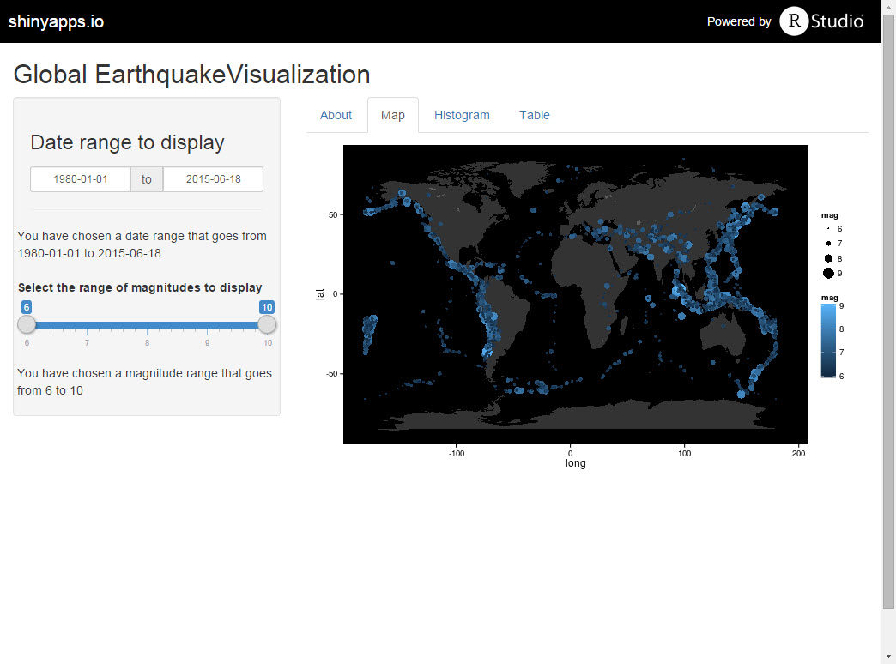
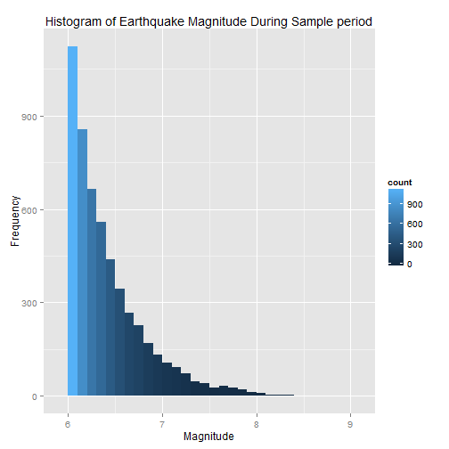

Creating Data Products Final Project: Earthquake Visualization
========================================================
author: Peter Forbes
date: 06/18/2015
transition: rotate

Earthquake Visualization
========================================================
I chose to use the USGS database on global earthquake activity as the basis for the shiny app. 

Users will have the ability to
- Select the range of years to include
- Select the range of earthquake magnitudes to include 

Output includes
- A world map with earthquake activity meeting the criteria
- A histogram of earthquake magnitudes meeting the criteria

The source data can be found [here](http://earthquake.usgs.gov/earthquakes/search/)  
Additional documentation on the data catalog can be found [here](http://earthquake.usgs.gov/earthquakes/map/doc_aboutdata.php)

App Interface
========================================================
Here is a screen shot of the app interface and world map for all earthquakes in the data set. 

Distribution of Earthquake Magnitudes
========================================================
The following plot is generated using the full data set.  
 
  
Follow the link to the Github repo on page 5 to see the code. 

Links to the App and related information
========================================================

Click [here](https://psforbes.shinyapps.io/Shiny_Project) to open the Shiny App

Click [here](https://github.com/psforbes/DataProd_project) to view the code on GitHub

This R presentation was created in R Studio. I hope you enjoyed the exercise in creating and sharing Shiny applications.   
  
Good luck in this course and with the Capstone project! 

